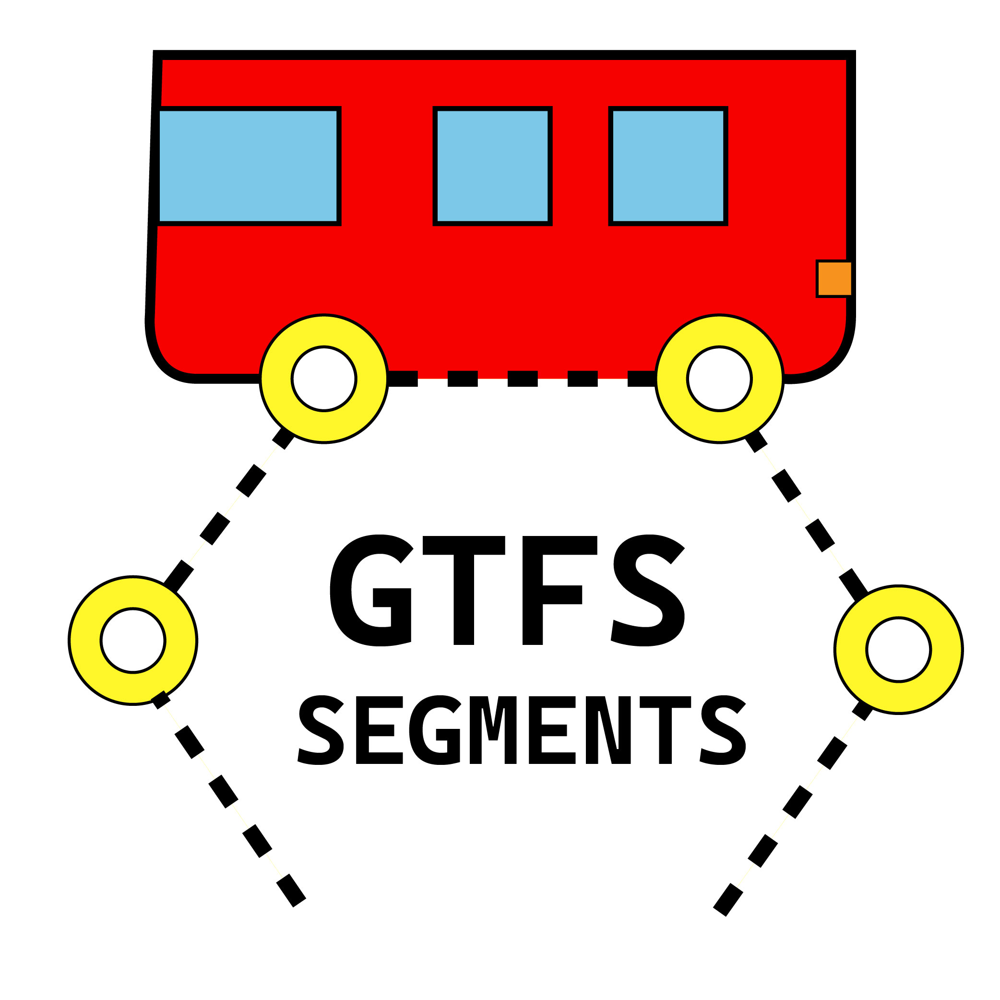
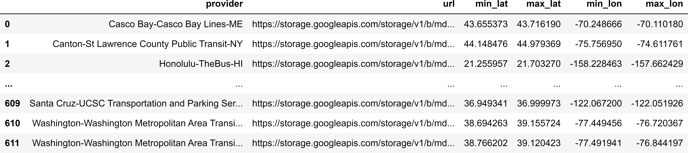
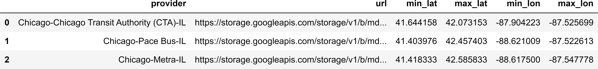
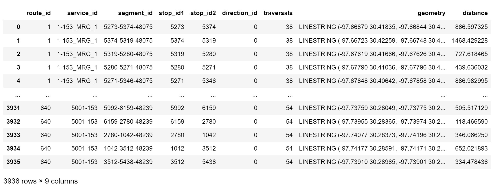
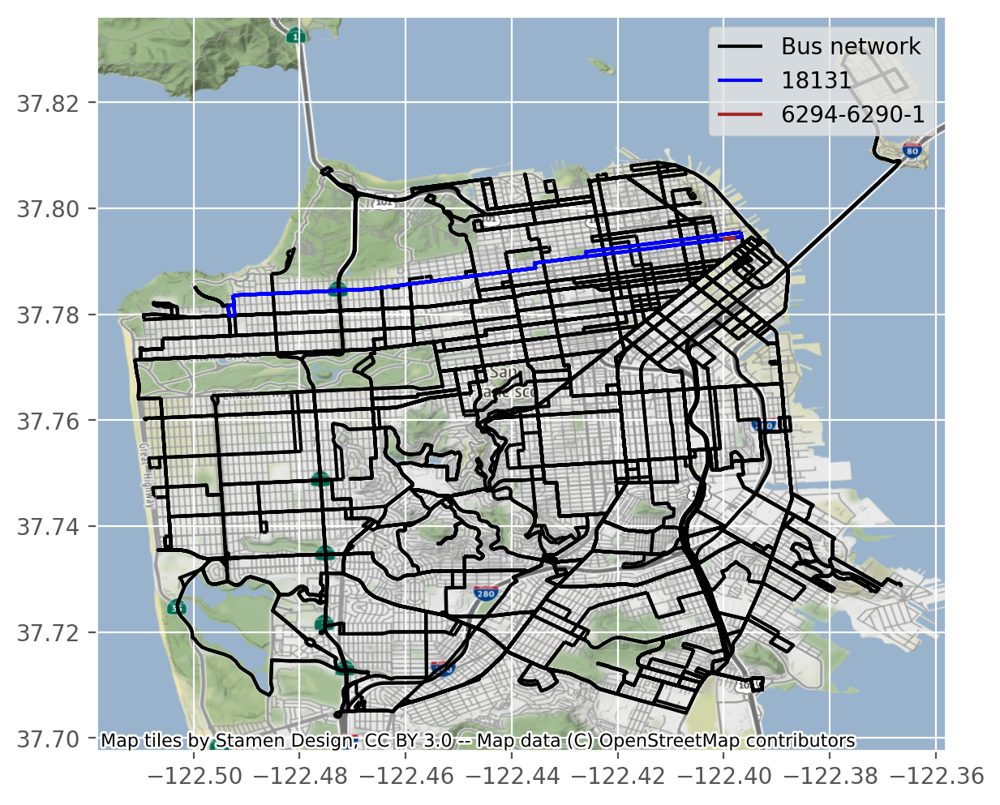
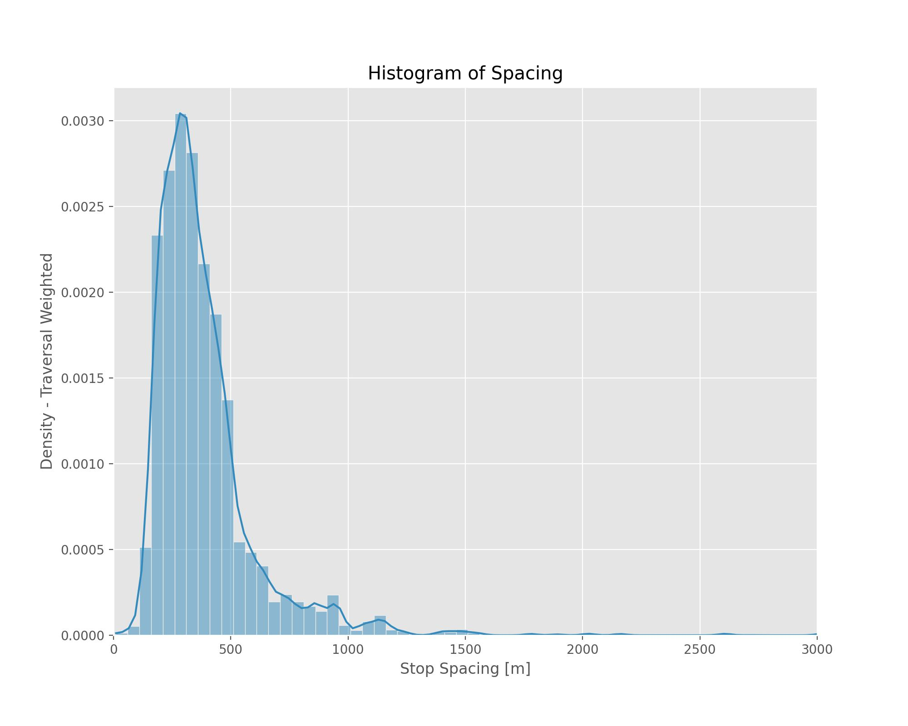
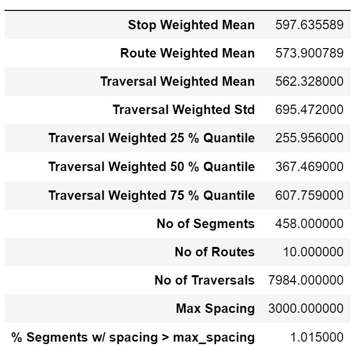

<div id="top"></div>
<!--
*** Adapted from Best-README-Template
-->

[![Contributors][contributors-shield]][contributors-url]
[![Forks][forks-shield]][forks-url]
[![Stargazers][stars-shield]][stars-url]
[![Issues][issues-shield]][issues-url]
[![MIT License][license-shield]][license-url]
<!-- [![LinkedIn][linkedin-shield]][linkedin-url] -->


<!-- PROJECT LOGO -->
<br />
<div align="center">
  <a href="https://github.com/UTEL-UIUC/gtfs_segments">
    
  </a>

<h3 align="center">GTFS Segments</h3>

  <p align="center">
    A fast and efficient library to generate bus stop spacings
    <br />
    <!-- <a href="https://github.com/UTEL-UIUC/gtfs_segments"><strong>Explore the docs »</strong></a>
    <br />
    <br />
    <a href="https://github.com/UTEL-UIUC/gtfs_segments">View Demo</a>
    ·
    <a href="https://github.com/UTEL-UIUC/gtfs_segments/issues">Report Bug</a>
    ·
    <a href="https://github.com/UTEL-UIUC/gtfs_segments/issues">Request Feature</a> -->
  </p>
</div>


<!-- TABLE OF CONTENTS -->
<details>
  <summary>Table of Contents</summary>
  <ol>
    <li>
      <a href="#about-the-project">About The Project</a>
    </li>
    <li>
      <a href="#getting-started">Getting Started</a>
      <ul>
        <li><a href="#prerequisites">Prerequisites</a></li>
        <li><a href="#installation">Installation</a></li>
      </ul>
    </li>
    <li><a href="#usage">Usage</a></li>
      <ul>
        <li><a href="#get-gtfs-files">Get GTFS Files</a></li>
        <li><a href="#get-gtfs-segments">Get GTFS Segments</a></li>
        <li><a href="#visualize-spacings">Visualize Spacings</a></li>
        <li><a href="#plot-distributions"> Plot Distributions</a></li>
      </ul>
    <!-- <li><a href="#roadmap">Roadmap</a></li> -->
    <li><a href="#contributing">Contributing</a></li>
    <li><a href="#license">License</a></li>
    <li><a href="#contact">Contact</a></li>
    <li><a href="#acknowledgments">Acknowledgments</a></li>
  </ol>
</details>


<!-- ABOUT THE PROJECT -->
# About The Project
<!-- <div align="center">
  
</div> -->

Transit agencies use the General Transit Feed Specification (GTFS) to publish transit data. More and more cities across the globe are adopting this GTFS format to represent their transit network. The GTFS feed can be downloaded from [@transitfeeds](https://transitfeeds.com/) and [@mobility data](https://mobilitydata.org/). The GTFS segments is a concise representation of GTFS files removing unnecessary repetitions in the data. We do that by considering the services offered only the busiest day(in the data) and representing data in the form of segements. 
<p align="right">(<a href="#top">back to top</a>)</p>

<!-- GETTING STARTED -->
# Getting Started

## Prerequisites
The major dependencies of this library are the following packages. 
* numpy
* shapely
* pandas
* geopandas
* partridge
* matplotlib
* contextily

The detailed list of package dependencies can be found in `requirements.txt`

## Installation

### Option A

Use pip to install the package. Windows users may have to download and install Microsoft Visual C++ distributions. Follow [these](https://stackoverflow.com/questions/29846087/error-microsoft-visual-c-14-0-is-required-unable-to-find-vcvarsall-bat) instructions. 

```sh
pip install gtfs-segments
```
### Option B

1. Clone the repo
    ```sh
    git clone https://github.com/UTEL-UIUC/gtfs_segments.git
    ```
2. Install geopandas using the following code. Read more [here](https://geopandas.org/en/stable/getting_started/install.html)
    ```sh
    conda create -n geo_env
    conda activate geo_env
    conda config --env --add channels conda-forge
    conda config --env --set channel_priority strict
    conda install python=3 geopandas
    ```
3. [Optional] Download modified version of `partridge` library and install it manually.
    ```sh
    git clone https://github.com/praneethd7/partridge
    cd partridge
    python setup.py install
    ```
4. Install requirements using
    ```sh
    pip install -r requirements.txt
    ```     
5. Install the `gtfs_segments` package
    ```sh
    cd gtfs_segments
    python setup.py install
    ```
<p align="right">(<a href="#top">back to top</a>)</p>

<!-- USAGE EXAMPLES -->
# Usage

For documentation, please refer to the [Documentation](https://utel-uiuc.github.io/gtfs_segments_docs/)_

Import the package using 
```python
import gtfs_segments
```
## Get GTFS Files

### Automated Download  

#### Fetch all sources
```python
from gtfs_segments import fetch_gtfs_source
sources_df = fetch_gtfs_source()
sources_df.head()
```
<a>
    
</a>

#### Fetch source by name/provider/state
```python
from gtfs_segments import fetch_gtfs_source
sources_df = fetch_gtfs_source(place ='Chicago')
sources_df
```
<a>
    
</a>

#### Download the latest GTFS source files
```python
from gtfs_segments import download_latest_data
download_latest_data(sources,"output_folder")
```
### Manual Download
Download the GTFS `.zip` files from [@transitfeeds](https://transitfeeds.com/) or [@mobility data](https://mobilitydata.org/).


## Get GTFS Segments
```python
from gtfs_segments import get_gtfs_segments
segments_df = get_gtfs_segments("path_to_gtfs_zip_file")
segments_df
```
<a>
    
</a>

## Visualize Spacings

```python
from gtfs_segments import view_spacings
view_spacings(df,route = '18131',segment = '6294-6290-1',basemap=True)
```
<center><a>
    
</a></center>

## Plot Distributions
```python
from gtfs_segments import plot_hist
plot_hist(segments_df)
```
<a>
    
</a>

Optionally save figure using
```python
plot_hist(segments_df,file_path = "spacings_hist.png",save_fig = True)
```

## Get Summary Stats
```python
from gtfs_segments import summary_stats
summary_stats(segments_df,max_spacing = 3000,export = True,file_path = "summary.csv")
```
<a>
    
</a>


## Download Data
Download the data as either `.csv` or `.geojson`
```python
from gtfs_segments import export_segments
export_segments(segments_df,'filename', output_format ='geojson')
# Get csv without geometry
export_segments(segments_df,'filename', output_format ='csv',geometry = False)
```

<p align="right">(<a href="#top">back to top</a>)</p>


<!-- ROADMAP -->
<!-- ## Roadmap

- [ ] Feature 1
- [ ] Feature 2
- [ ] Feature 3
    - [ ] Nested Feature

See the [open issues](https://github.com/UTEL-UIUC/gtfs_segments/issues) for a full list of proposed features (and known issues).

<p align="right">(<a href="#top">back to top</a>)</p>
 -->


<!-- LICENSE -->
# License

Distributed under the MIT License. See `LICENSE.txt` for more information.

<p align="right">(<a href="#top">back to top</a>)</p>

## Citing gtfs-segments
If you use gtfs-segments in your research please use the following BibTeX entry:

```
@Misc{gtfs_segments,
    author =       {Devunuri, Saipraneeth},
    title =        {gtfs-segments - A fast and efficient library to generate bus stop spacings},
    howpublished = {Github},
    year =         {2022},
    url =          {https://github.com/UTEL-UIUC/gtfs_segments}
}
```

<!-- CONTRIBUTING -->
# Contributing

Contributions are what make the open source community such an amazing place to learn, inspire, and create. Any contributions you make are **greatly appreciated**.

If you have a suggestion that would make this better, please fork the repo and create a pull request. You can also simply open an issue with the tag "enhancement".
Don't forget to give the project a star! Thanks again!

1. Fork the Project
2. Create your Feature Branch (`git checkout -b feature/AmazingFeature`)
3. Commit your Changes (`git commit -m 'Add some AmazingFeature'`)
4. Push to the Branch (`git push origin feature/AmazingFeature`)
5. Open a Pull Request

<p align="right">(<a href="#top">back to top</a>)</p>


<!-- CONTACT -->
# Contact

Saipraneeth Devunuri - [@praneethDevunu1](https://twitter.com/praneethDevunu1) - sd37@illinois.edu

Project Link: [https://github.com/UTEL-UIUC/gtfs_segments](https://github.com/UTEL-UIUC/gtfs_segments)

<!-- <p align="right">(<a href="#top">back to top</a>)</p> -->


<!-- ACKNOWLEDGMENTS -->
# Acknowledgments

* Parts of the code use the [Partridge](https://github.com/remix/partridge) library 
* Shoutout to [Mobility Data](https://mobilitydata.org) for compiling GTFS from around the globe and constantly maintaining them

<p align="right">(<a href="#top">back to top</a>)</p>


<!-- MARKDOWN LINKS & IMAGES -->
<!-- https://www.markdownguide.org/basic-syntax/#reference-style-links -->
[contributors-shield]: https://img.shields.io/github/contributors/UTEL-UIUC/gtfs_segments.svg?style=for-the-badge
[contributors-url]: https://github.com/UTEL-UIUC/gtfs_segments/graphs/contributors
[forks-shield]: https://img.shields.io/github/forks/UTEL-UIUC/gtfs_segments.svg?style=for-the-badge
[forks-url]: https://github.com/UTEL-UIUC/gtfs_segments/network/members
[stars-shield]: https://img.shields.io/github/stars/UTEL-UIUC/gtfs_segments.svg?style=for-the-badge
[stars-url]: https://github.com/UTEL-UIUC/gtfs_segments/stargazers
[issues-shield]: https://img.shields.io/github/issues/UTEL-UIUC/gtfs_segments.svg?style=for-the-badge
[issues-url]: https://github.com/UTEL-UIUC/gtfs_segments/issues
[license-shield]: https://img.shields.io/github/license/UTEL-UIUC/gtfs_segments.svg?style=for-the-badge
[license-url]: https://github.com/UTEL-UIUC/gtfs_segments/blob/master/LICENSE
[linkedin-shield]: https://img.shields.io/badge/-LinkedIn-black.svg?style=for-the-badge&logo=linkedin&colorB=555
[linkedin-url]: https://linkedin.com/in/linkedin_username
[product-screenshot]: images/screenshot.png
