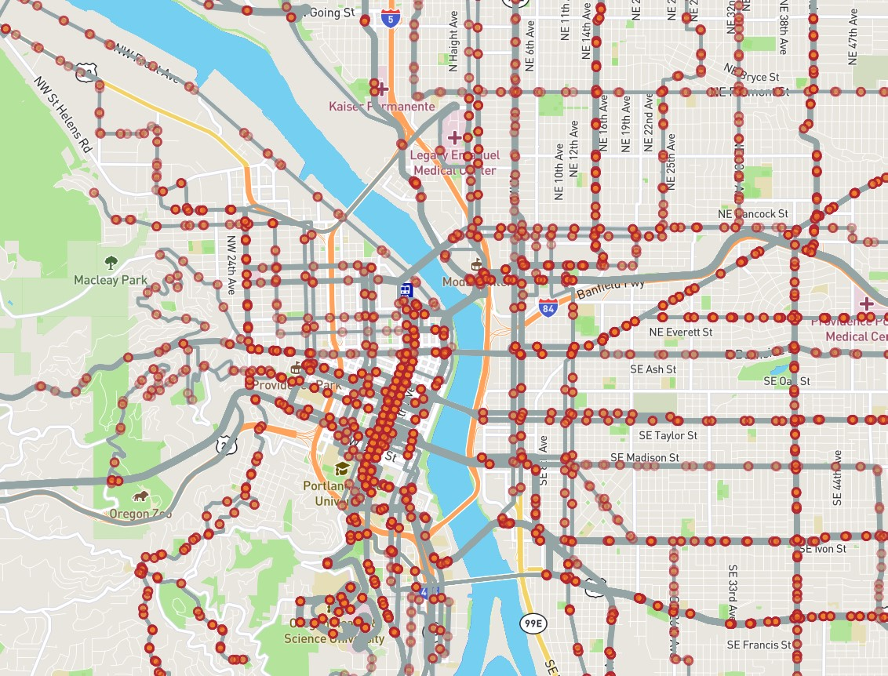

<div id="top"></div>
<!--
*** Adapted from Best-README-Template
-->


[](https://gtfs-segments.readthedocs.io/en/latest/?badge=latest)
[](https://pypi.org/project/gtfs-segments/)
[](https://pepy.tech/project/gtfs-segments)
[](https://colab.research.google.com/drive/1mGmFxw8G194bmg3VQm6vg7dVxCt715eD?usp=sharing)
[](https://doi.org/10.5281/zenodo.10019419)

[](https://doi.org/10.1016/j.jpubtr.2024.100083)
[![Stargazers][stars-shield]][stars-url]
[![Issues][issues-shield]][issues-url]
[![MIT License][license-shield]][license-url]
<!-- [![Contributors][contributors-shield]][contributors-url] -->
<!-- [![Forks][forks-shield]][forks-url] -->

<!-- PROJECT LOGO -->
<div align="center">
  <a href="https://github.com/UTEL-UIUC/gtfs_segments">
    
  </a>

<h3 align="center">GTFS Segments</h3>
  <p align="center">
    A fast and efficient library to generate bus stop spacings
    <br />
    <!-- <a href="https://github.com/UTEL-UIUC/gtfs_segments"><strong>Explore the docs »</strong></a>
    <br />
    <br />
    <a href="https://github.com/UTEL-UIUC/gtfs_segments">View Demo</a>
    ·
    <a href="https://github.com/UTEL-UIUC/gtfs_segments/issues">Report Bug</a>
    ·
    <a href="https://github.com/UTEL-UIUC/gtfs_segments/issues">Request Feature</a> -->
  </p>
</div>

<!-- TABLE OF CONTENTS -->
<details>
  <summary>Table of Contents</summary>
  <ol>
    <li>
      <a href="#about-the-project">About The Project</a>
    </li>
    <li>
      <a href="#getting-started">Getting Started</a>
      <ul>
        <li><a href="#prerequisites">Prerequisites</a></li>
        <li><a href="#installation">Installation</a></li>
      </ul>
    </li>
    <li><a href="#usage">Usage</a></li>
      <ul>
        <li><a href="#get-gtfs-files">Get GTFS Files</a></li>
        <li><a href="#get-gtfs-segments">Get GTFS Segments</a></li>
        <li><a href="#visualize-spacings">Visualize Spacings</a></li>
        <li><a href="#plot-distributions"> Plot Distributions</a></li>
      </ul>
    <li><a href="#roadmap">Roadmap</a></li>
    <li><a href="#contributing">Contributing</a></li>
    <li><a href="#license">License</a></li>
    <li><a href="#contact">Contact</a></li>
    <li><a href="#acknowledgments">Acknowledgments</a></li>
  </ol>
</details>

<!-- ABOUT THE PROJECT -->
# About The Project
<!-- <div align="center">
  
</div> -->

The `gtfs-segments` is a Python (3.9+) package that represents GTFS data for **buses** in a concise tabular manner using segments. The distribution of bus stop spacings can be viewed by generating histograms. The stop spacings can be visualized at the network, route, or segment level. The segment data can be exported to well-known formats such as `.csv` or `.geojson` for further analysis. Additionally, the package provides commands to download the latest data from [@mobility data](https://mobilitydata.org/) sources.

The package condenses the raw GTFS data by considering the services offered only on the `busiest day`(in the data). More discussion on the interpretation of different weightings for stop spacings, and the process in which the package condenses information can be seen in our [paper](https://doi.org/10.1016/j.jpubtr.2024.100083). The usage of the package is detailed in [documentation](https://gtfs-segments.readthedocs.io/en/latest/). The stop spacings dataset containing over 540 transit providers in the US generated using this package can be found on [Harvard Dataverse](https://doi.org/10.7910/DVN/SFBIVU).

<p align="right">(<a href="#top">back to top</a>)</p>

<!-- GETTING STARTED -->
# Getting Started

## Prerequisites

The major dependencies of this library are the following packages.
<table>
<tr>
</tr>
<tr>
<td>
<ul>
  <li>numpy</li>
  <li>shapely</li>
  <li>pandas</li>
  <li>scipy</li>
</ul>
</td>
<td>
<ul>
  <li>geopandas</li>
  <li>matplotlib</li>
  <li>contextily</li>
</ul>
</td>
</tr>
</table>

The detailed list of package dependencies can be found in `requirements.txt`

## Installation

### Option A

Use pip to install the package.

```sh
pip install gtfs-segments
```

> ℹ️ Windows users may have to download and install Microsoft Visual C++ distributions. Follow [these](https://stackoverflow.com/questions/29846087/error-microsoft-visual-c-14-0-is-required-unable-to-find-vcvarsall-bat) instructions.

> 📓 <b> Google Colab :</b> You can install and use the `gtfs-segments` via google colab. Here is a [tutorial](https://colab.research.google.com/drive/1mGmFxw8G194bmg3VQm6vg7dVxCt715eD?usp=sharing
) to help you get started. Make a copy and get started with your work!

### **Option** B

1. Clone the repo

    ```sh
    git clone https://github.com/UTEL-UIUC/gtfs_segments.git
    ```

2. Install geopandas using the following code. Read more [here](https://geopandas.org/en/stable/getting_started/install.html)

    ```sh
    conda create -n geo_env -c conda-forge python=3.11 geopandas
    conda activate geo_env
    ```

3. Install the `gtfs_segments` package

    ```sh
    cd gtfs_segments
    python setup.py install
    ```

<p align="right">(<a href="#top">back to top</a>)</p>

<!-- USAGE EXAMPLES -->
# Usage

> ℹ️ For documentation, please refer to the [Documentation](https://gtfs-segments.readthedocs.io/en/latest/)

Import the package using

```python
import gtfs_segments
```

## Get GTFS Files

### Fetch all sources

```python
from gtfs_segments import fetch_gtfs_source
sources_df = fetch_gtfs_source()
sources_df.head()
```

<div align='center'><a>
    
</a></div>  

### Fetch source by name/provider/state

```python
from gtfs_segments import fetch_gtfs_source
sources_df = fetch_gtfs_source(place ='Chicago')
sources_df
```

<div align='center'><a>
    
</a></div>

## Automated Download  

```python
from gtfs_segments import download_latest_data
download_latest_data(sources_df,"output_folder")
```

## Manual Download

Download the GTFS `.zip` files from [@transitfeeds](https://transitfeeds.com/) or [@mobility data](https://database.mobilitydata.org/).

## Get GTFS Segments

```python
from gtfs_segments import get_gtfs_segments
segments_df = get_gtfs_segments("path_to_gtfs_zip_file")
# [Optional] Run in parallel using multiple CPU cores
segments_df = get_gtfs_segments("path_to_gtfs_zip_file", parallel = True)
```

Alternatively, filter a specific agency by passing `agency_id` as a string or multiple agencies as list ["SFMTA",]

```
segments_df = get_gtfs_segments("path_to_gtfs_zip_file",agency_id = "SFMTA")
segments_df
```

<div align='center'><a>
    
</a></div>  
Table generated by gtfs-segments using data from San Francisco’s Muni system. Each row contains the following columns:

1. `segment_id`: the segment's identifier, produced by gtfs-segments
2. `stop_id1`: the identifier of the segment's beginning stop. The identifier is the same one the agency has chosen in the stops.txt file of its GTFS package.
3. `stop_id2`: The identifier of the segment's ending stop.
4. `route_id`: The same route ID listed in the agency's routes.txt file.
5. `direction_id`: The route's direction identifier.
6. `traversals`: The number of times the indicated route traverses the segment during the "measurement interval." The "measurement interval" chosen is the busiest day in the GTFS schedule: the day which has the most bus services running.
7. `distance`: The length of the bus segment in meters.
8. `geometry`: The segment's LINESTRING (a format for encoding geographic paths). All geometries are re-projected onto Mercator (EPSG:4326/WGS84) to maintain consistency.
9. `traversal_time`: The time (in seconds) that it takes for the bus to traverse the segment.
10. `speed`: The speed of the bus (in kmph) while traversing the segment. Default to `np.inf`♾ in case `traversal_time` is zero.

Each row does not represent one segment. Rather, each row maps to a combination of a segment, a route that includes that segment, and a direction. For instance, a segment included in eight routes will appear as eight rows, which will have the same information except for route_id and traversals (since some routes might traverse the segment more than others). This choice enables filtering by route and preserves how many times each route traverses each segment during the measurement interval. The direction identifier is used for very rare cases (mostly loops) in which a route visits the same two stops, in the same order, but in different directions.

## Visualize Spacings
Visualize stop spacings at network, route and segments levels along with basemaps and stop locations.
> 
> ℹ️ For more information on visualization refer to the [Visualization Tutorial](https://gtfs-segments.readthedocs.io/en/latest/tutorials/Visualization)

> ℹ️ Alternatively, use `view_spacings_interactive` to view the stop spacings interactively.

```python
from gtfs_segments import view_spacings
view_spacings(segments_df,route = '8',segment = '6364-3725-1',basemap=True)
```

<div align='center'><a>
    
</a></div>  

### Heatmap
View the heatmap of stop spacings ("distance" as metric). Use `Diverging` colormaps to highlight narrow and wide spacings. Set `light_mode = False` for Dark mode.

```python
from gtfs_segments import view_heatmap
f = view_heatmap(df, cmap='RdBu', light_mode=True)
``` 

<div align='center'><a>
    
</a></div>  

```python
view_heatmap(df, cmap="YlOrRd", interactive=True, light_mode=False)
``` 
<div align='center'><a>
    
</a></div>  

### Plot Distributions

```python
from gtfs_segments import plot_hist
plot_hist(segments_df, max_spacing = 1200)
```

<div align='center'><a>
    
</a></div>  Optionally save figures using

```python
plot_hist(segments_df,file_path = "spacings_hist.png",save_fig = True)
```

## Summary Statistics

### Get Network Summary Stats
```python
from gtfs_segments import summary_stats
summary_stats(segments_df,max_spacing = 3000,export = True,file_path = "summary.csv")
```

<div align = 'center'><a>
    
</a></div>  

### Get Route Summary Stats

```python
from gtfs_segments import get_route_stats,get_bus_feed
feed = get_bus_feed('path_to_gtfs.zip')
get_route_stats(feed)
```

<div align = 'center'><a>
    
</a></div>

Here each row contains the following columns:

1. `route`: The `route_id` for the route of interest
2. `direction`: The `direction_id` of the route
3. `route_length`: The total length of the route. `Units`: Kilometers (Km)
4. `total time`: The total scheduled time to travel the whole route. `Units`: Hours (Hr)
5. `headway`: The average headway between consecutive buses for the route. A `NaN` indicates only 1 trip. `Units`: Hours (Hr)
6. `peak_buses`: The 15-minute interval where the route has the maximum number of buses concurrently running.
7. `average_speed`: The average speed of the bus along the route. `Units`: Kmph
8. `n_bus_avg`: The average number of buses concurrently running
9. `bus_spacing`: The average spacing (in distance) between consecutive buses. `Units:` Kilometers (Km)
10. `stop_spacing`: The average distance between two consecutive stops. `Units:` Kilometers (Km)

## Download Segments Data

Download the data as either `.csv` or `.geojson`

```python
from gtfs_segments import export_segments
export_segments(segments_df,'filename', output_format ='geojson')
# Get csv without geometry
export_segments(segments_df,'filename', output_format ='csv',geometry = False)
```

<p align="right">(<a href="#top">back to top</a>)</p>

<!-- ROADMAP -->
# Roadmapackage
- [x] Add interactive visualization with folium
- [ ] Visualize catchment areas for stops
- [ ] Log trips that do not have shapes


See the [open issues](https://github.com/UTEL-UIUC/gtfs_segments/issues) for a full list of proposed features (and known issues).

<p align="right">(<a href="#top">back to top</a>)</p>

<!-- LICENSE -->
# License

Distributed under the MIT License. See [`LICENSE.txt`](https://github.com/UTEL-UIUC/gtfs_segments/blob/main/LICENSE) for more information.

<!-- <p align="right">(<a href="#top">back to top</a>)</p> -->

## Citing gtfs-segments

If you use gtfs-segments in your research please use the following BibTeX entry:

```bibtex
@software{devunuri_gtfs_segments,
author = {Devunuri, Saipraneeth and Lehe, Lewis},
doi = {10.5281/zenodo.10019419},
month = Oct,
title = {{GTFS Segments: A fast and efficient library to generate bus stop spacings}},
url = {https://github.com/UTEL-UIUC/gtfs_segments},
version = {2.0.3},
year = {2023}
}

```

## Citing stop spacings paper

If you use [stop spacings paper](https://doi.org/10.1016/j.jpubtr.2024.100083) in your research please use the following BibTeX entry:

```bibtex
@article{Devunuri2024,
  title = {Bus Stop Spacing Statistics: {{Theory}} and Evidence},
  shorttitle = {Bus Stop Spacing Statistics},
  author = {Devunuri, Saipraneeth and Lehe, Lewis J. and Qiam, Shirin and Pandey, Ayush and Monzer, Dana},
  year = {2024},
  month = jan,
  journal = {Journal of Public Transportation},
  volume = {26},
  pages = {100083},
  issn = {1077-291X},
  doi = {10.1016/j.jpubtr.2024.100083},
  url = {https://www.sciencedirect.com/science/article/pii/S1077291X24000031},
  urldate = {2024-03-07},
  keywords = {Bus stop,GTFS,Public Transit,Stop Spacings,Transit Planning}
}
```
<!-- 
## Citing stop spacings dataset
If you use the stop spacings dataset in your research please use the following BibTeX entry:

```bibtex
@data{DVN/SFBIVU_2022,
  author = {Devunuri, Saipraneeth and Shirin Qiam and Lewis Lehe},
  publisher = {Harvard Dataverse},
  title = {{Bus Stop Spacings for Transit Providers in the US}},
  UNF = {UNF:6:zUgB0CGrPL27iqhKd/umRA==},
  year = {2022},
  version = {V1},
  doi = {10.7910/DVN/SFBIVU},
  url = {https://doi.org/10.7910/DVN/SFBIVU}
}
``` -->

<p align="right">(<a href="#top">back to top</a>)</p>

<!-- CONTRIBUTING -->
# Contributing

Contributions are what makes the open-source community such an amazing place to learn, inspire, and create. Any contributions you make are **greatly appreciated**.

If you have a suggestion that would make this better, please fork the repo and create a pull request. You can also simply open an issue with the tag "enhancement".
Don't forget to give the project a star! Thanks again!

1. Fork the Project
2. Create your Feature Branch (`git checkout -b feature/AmazingFeature`)
3. Commit your Changes (`git commit -m 'Add some AmazingFeature'`)
4. Push to the Branch (`git push origin feature/AmazingFeature`)
5. Open a Pull Request

For more information refer to [CONTRIBUTING.md](https://github.com/UTEL-UIUC/gtfs_segments/docs/CONTRIBUTING.md)

<!-- CONTACT -->
# Contact

Saipraneeth Devunuri - [@praneethDevunu1](https://twitter.com/praneethDevunu1) - <sd37@illinois.edu>

Project Link: [https://github.com/UTEL-UIUC/gtfs_segments](https://github.com/UTEL-UIUC/gtfs_segments)

<!-- <p align="right">(<a href="#top">back to top</a>)</p> -->

<!-- ACKNOWLEDGMENTS -->
# Acknowledgments

- Parts of the code use the [Partridge](https://github.com/remix/partridge) library
- Do check out [gtfs_functions](https://github.com/Bondify/gtfs_functions) which was an inspiration for this project
- Shoutout to [Mobility Data](https://mobilitydata.org) for compiling GTFS from around the globe and constantly maintaining them

<p align="right">(<a href="#top">back to top</a>)</p>

<!-- MARKDOWN LINKS & IMAGES -->
<!-- https://www.markdownguide.org/basic-syntax/#reference-style-links -->
[contributors-shield]: https://img.shields.io/github/contributors/UTEL-UIUC/gtfs_segments.svg?style=for-the-badge
[contributors-url]: https://github.com/UTEL-UIUC/gtfs_segments/graphs/contributors
[forks-shield]: https://img.shields.io/github/forks/UTEL-UIUC/gtfs_segments.svg?style=for-the-badge
[forks-url]: https://github.com/UTEL-UIUC/gtfs_segments/network/members
[stars-shield]: https://img.shields.io/github/stars/UTEL-UIUC/gtfs_segments.svg?style=for-the-badge
[stars-url]: https://github.com/UTEL-UIUC/gtfs_segments/stargazers
[issues-shield]: https://img.shields.io/github/issues/UTEL-UIUC/gtfs_segments.svg?style=for-the-badge
[issues-url]: https://github.com/UTEL-UIUC/gtfs_segments/issues
[license-shield]: https://img.shields.io/github/license/UTEL-UIUC/gtfs_segments.svg?style=for-the-badge
[license-url]: https://github.com/UTEL-UIUC/gtfs_segments/blob/master/LICENSE
