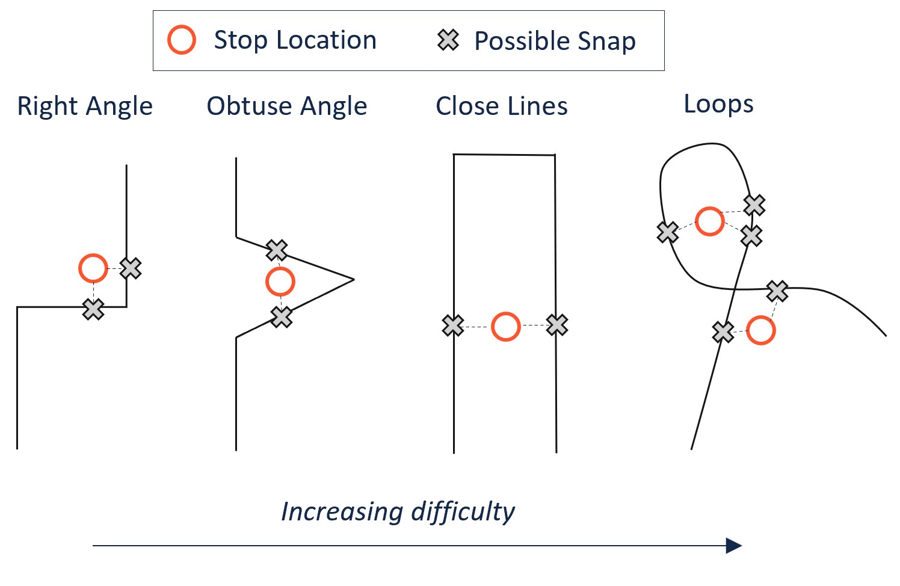

# Summary

The GTFS Segments (gtfs-segments) library is an open-source Python toolkit for computing and analyzing bus stop spacings: the distance a transit bus travels between stops. The library reads General Transit Feed Specification (GTFS) data, snaps bus stops to points along routes, divides routes into segments (the pieces of routes between two stops), and then produces a `GeoDataFrame` containing information about each segment. The library also features a number of functions that act on this GeoDataFrame. It can produce summary statistics of the spacings for a given network, using various weighting schemes (i.e., weighting by frequency of service), as well as histograms of spacings that display their full distribution. In addition to network-level statistics, the package can also compute statistics for each route, such as its length, headway, speed, and average stop spacing. It can draw maps of networks, routes, or segments over a basemap---which allows the user to manually validate data. The segments data can be exported to `.csv` and `.geojson` files. The package can fetch the most up-to-date GTFS data from Mobility Data[@MobData2023] repositories for user convenience.

# Statement of need

The choice of bus stop spacing involves a tradeoff between accessibility and speed: wider spacings mean passengers must travel farther to/from stops, but they allow the bus to move faster[@Wu2022]. Many US transit agencies have recently carried out *stop consolidation* campaigns which systematically remove stops, due partly to the perception US stop spacings are much narrower than those abroad. However, there are no reliable data sources to obtain current stop spacings despite wide adoption of General Transit Feed Specification (GTFS) [@Voulgaris2023Predictors], because GTFS does not include data on stop spacings directly. Spacings must be computed from route shape geometries, stop locations, and stop sequences. A challenge is that stop locations are not placed on top of route shapes and therefore must be somehow projected onto the route's `LINESTRING`. To make spacings available for analysis, `gtfs-segments` uses k-dimensional spatial trees and k-nearest neighbor heuristics to snap stops to routes and divide routes into segments for computation of spacings, as described below.

`gtfs-segments` was designed for researchers, transit planners, students and anyone interested in bus networks. The package has been used in several scholarly articles [@devunuri2023bus; @devunuri2023chatgpt; @lehe4135394bus] and to create databases of spacings for over 550 agencies in the US [@DVN/SFBIVU_2022] and 80 agencies in Canada[@DVN/QFTAPM_2023]. Several transit agencies, such as Regional Transportation District Denver (RTD- Denver), have used the package to visualize the effects of their bus stop consolidation efforts. Filtering functions allow the user to explore datasets, identify errors and compute specialized statistics.

# Functionality

## Computing segments

A `segment` is defined by three elements: (i) a start stop, (ii) end stop and (iii) the path that the bus travels along the route in between the two consecutive stops. The segments are computed using route shape geometries and stop locations included in GTFS data. Packages such as `gtfs2gps`[@pereira2023exploring] and `gtfs_functions`[@Toso2023] can compute segments, but this package does so in computationally-efficient way and includes a new way to account for cases when the reported stop locations are misaligned with the route shapes. \autoref{fig:example} provides some example cases where a stop is equidistant from multiple points on a route. Thus, projecting the stop onto the route or snapping to nearest geo-coordinate (lat,lon) may produce errors, such as stops that are out-of-order or stop being snapped far from their locations. Also, the time complexity of projection or snapping is $O(mn)$ using brute force for `m` geo-coordinates that represent the route shape and `n` stops that have to projected.

`gtfs-segments` overcomes these challenges by increasing the route resolution (i.e., adding points in-between geo-coordinates), using spatial k-d trees, and using more than one nearest neighbor. The increase in resolution allows stops to be snapped to nearby points. k-d trees[@maneewongvatana1999analysis] reduce the time complexity to $O(nlog(m))$ and make it possible to compare among several snapping points without added computation. \autoref{fig:interpolate} shows a difficult example route. In the first panel, snapping to the nearest point produces out-of-order stops (3/4/2) and stop 5 is snapped far away from its location. In the second panel, increased resolution fixes 5's location problem but the ordering problem persists. In the third panel, we use the `k=3` nearest neighbors and thus find a proper ordering. Once every stop has been snapped to a geo-coordinate on the route shape, the shape is segmented between stops and each segment represented by a `LINESTRING` for entry in the GeoDataFrame. In fact, `gtfs_segments` starts with `k=3` for the neighbors and doubles `k` until we find the correct sequence of stops or remove the corresponding trip. On average, fewer than 1% of trips fail, which can be manually corrected and validated.

![Improvement in snapping due to an increase in resolution and suing k-nearest neighbors.\label{fig:interpolate}. Adapted from "Bus Stop Spacings Statistics: Theory and Evidence" [@devunuri2023bus]](interpolation.jpg)

# Acknowledgements

The `gtfs-segments` package draws its inspiration from `gtfs_functions`[@Toso2023], `gtfs2gps`[@pereira2023exploring], and `partridge`[@Whalen2023] repositories. We thank the contributors of these packages for their excellent work. We also extend our thanks to Mobility Data[@MobData2023] for compiling GTFS from around the globe and constantly maintaining them.

# References